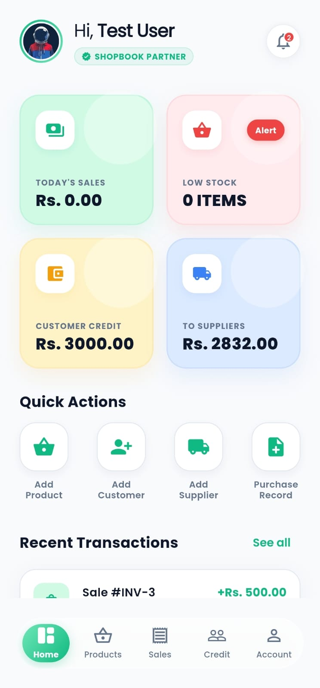
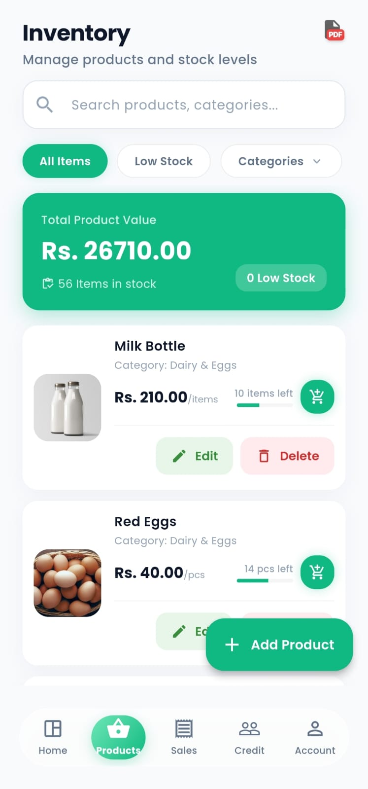
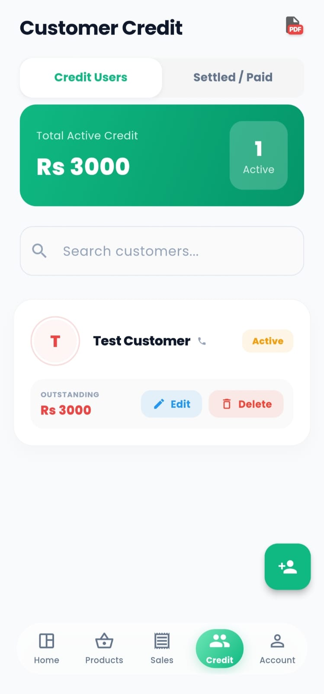
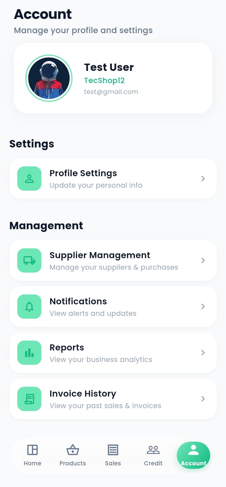
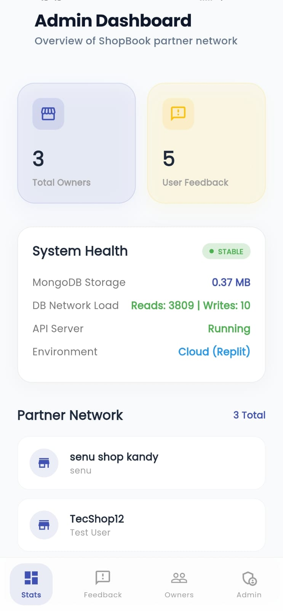
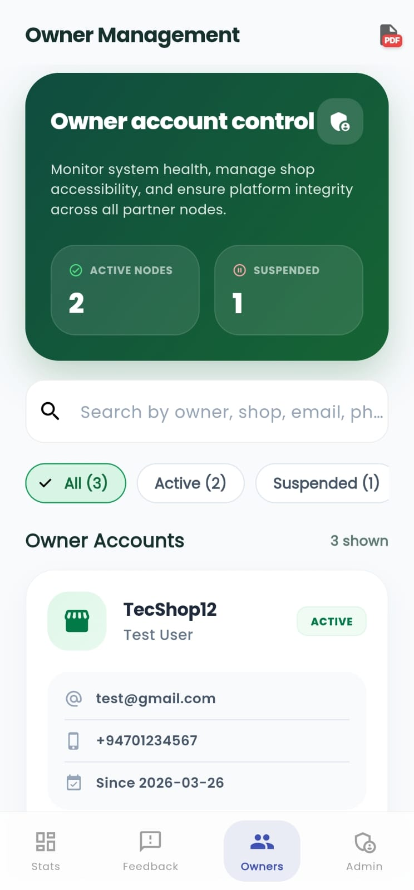

# ShopBook - Grocery Shop Manager

ShopBook is a modern, full-stack application designed to streamline inventory management, sales tracking, and customer credit for small to medium-sized grocery stores. It features a premium, iOS-inspired mobile interface and a robust Node.js backend.

## 📸 UI Gallery

<p align="center">
  
  
  
</p>
<p align="center">
  
  
  
</p>

## 🚀 Key Features

- **Multi-tenant Core**: Secure data isolation using `ownerId` scoping across the entire stack.
- **Inventory Management**: Real-time tracking of product stock, categories, and inventory value with out-of-stock alerts.
- **Supplier & Purchase Accounting**: Detailed tracking of historical purchase records with automated balance (actual debt) synchronization and itemized metadata snapshots.
- **Invoice History & PDF Reporting**: Professional, granular transaction logs and high-fidelity PDF reporting engine with item-by-item breakdown and full Unicode support.
- **Server-Side Database Backup**: Integrated utility for administrators to trigger and download secure database collection archives.
- **UDP Auto-Discovery**: Automated backend discovery service that dynamically identifies the host machine's IP address on the local network.
- **Total Wipeout Control**: Coordinated, multi-collection data erasure system for total privacy compliance and account deletion.
- **Administrative Dashboard Evolution**: Specialized portal for system managers with advanced feedback filtering and owner triage tools.
- **Advanced Error Diagnostics**: Comprehensive technical breakdown of backend failures (mapping status codes like 404, 500) within the mobile interface.
- **Premium UI/UX**: iOS-inspired design with frosted glass elements and frosted mint aesthetics for a cluttered-free experience.

## 🛠 Tech Stack

### Frontend
- **Framework**: [Flutter](https://flutter.dev/)
- **State Management**: [Provider](https://pub.dev/packages/provider)
- **Styling**: Modern Material Design with custom iOS-style components.
- **Networking**: `http` package for REST API communication.

### Backend
- **Core**: Node.js & [Express](https://expressjs.com/)
- **Database**: [MongoDB Atlas](https://www.mongodb.com/cloud/atlas) (via [Mongoose](https://mongoosejs.com/))
- **Hosting**: [Replit](https://replit.com/) (Production)
- **Architecture**: Clean architecture with Use Cases, Interfaces, and Infrastructure layers (Repositories).

## 📂 Project Structure

```text
small_store_app/
├── frontend/           # Flutter application source code
│   ├── lib/
│   │   ├── core/       # Shared utilities, themes, and network logic (includes SnackBarUtils)
│   │   ├── features/   # Feature-based modules (Products, Sales, Auth, etc.)
│   │   └── shared/     # Shared UI components & navigation (MainShell)
├── backend/            # Node.js API server
│   ├── src/
│   │   ├── domain/     # Business entities (Mongoose Schemas)
│   │   ├── usecases/   # Business logic / application services
│   │   ├── interfaces/ # Controllers and route definitions
│   │   └── infrastructure/ # Database repositories (MongoDB/Mongoose)
└── README.md           # Project documentation
```

## ⚙️ Getting Started

### Prerequisites
- [Flutter SDK](https://docs.flutter.dev/get-started/install)
- [Node.js](https://nodejs.org/) (v14+)
- **MongoDB Connection**: 
    > [!IMPORTANT]
    > Create a `.env` file in the `backend/` directory. You can use `.env.example` as a template.
    > Example: `MONGODB_URI=mongodb+srv://<user>:<password>@cluster.mongodb.net/shopbook`
    > 
    > **Blocked by Atlas?**: If the server exits immediately, your IP may not be whitelisted. 
    > Run `node src/utils/checkIp.js` in the `backend` folder to find your IP and add it to the Atlas console.

- **Cloudinary Account**:
    > [!IMPORTANT]
    > For product image uploads, you need a Cloudinary account. 
    > 1. Create a free account at [Cloudinary](https://cloudinary.com/).
    > 2. Create an **Unsigned** upload preset in Cloudinary Settings -> Upload.
    > 3. Update the configuration in `frontend/lib/core/config/cloudinary_config.dart` with your `cloudName` and `uploadPreset`.

- **Firebase Phone Authentication**:
    > [!IMPORTANT]
    > To enable SMS login for Sri Lankan mobile numbers:
    > 1. Ensure the **SMS Region Policy** in Firebase Console allows Sri Lanka (+94).
    > 2. Add your Android **SHA-1** and **SHA-256** certificates to the Firebase Project settings.
    > 3. Verify that `google-services.json` is present in `frontend/android/app/`.

### Setup & URL Switching

ShopBook features an intelligent backend discovery system that automatically switches between local development and production environments.

1. **Backend (Local)**:
   ```bash
   cd backend
   npm install
   npm start
   ```

2. **Frontend (Local/Debug)**:
   - For local testing, ensure the backend is running.
   - Use the **UDP Auto-Discovery** service or manually set the IP on the Login screen.
   ```bash
   cd frontend
   flutter pub get
   flutter run
   ```

3. **Production (Release Mode)**:
   - In release mode, the app automatically connects to the production backend:
   - `https://ba408787-5deb-46ee-bb7e-679a94333377-00-3jxj82plhfdn2.sisko.replit.dev/api`

> [!TIP]
> **Dynamic Backend Discovery**: ShopBook features an automated UDP discovery service that identifies the backend server's IP address on your local network. 
> 
> **Developer Note (Server Connection)**: To ensure a premium user experience, the server connection settings icon is hidden by default from pre-login screens. 
> - **To access settings**: Long-press (hold) the **ShopBook Logo** on the Login screen for **10 seconds**.
> - **Re-activation**: Developers can re-activate the visible gear icon by toggling the `showSettingsIcon` flag in `login_screen.dart` and setting `visible: true` in other auth screens.

## 📖 Documentation & Maintenance

### Design & Architecture Diagrams
- **[System Architecture](./diagrams/system_architecture.md)**: High-level overview of tiers and tech stack.
- **[Data Flow Diagram (DFD)](./diagrams/dfd_diagram.md)**: Visual mapping of data movement and processes.
- **[ER Diagram](./diagrams/er_diagram.md)**: Database schema and entity relationships.
- **[Use Case Diagram](./diagrams/use_case_diagram.md)**: Functional requirements and user interactions.

### Maintenance Logs
- **[bugs_and_fixes.md](./bugs_and_fixes.md)**: A chronological log of every technical challenge resolved.
- **[system_improvements.md](./system_improvements.md)**: A roadmap of architectural evolution and feature updates.

## 📄 License
This project is for internal use and development purposes.
