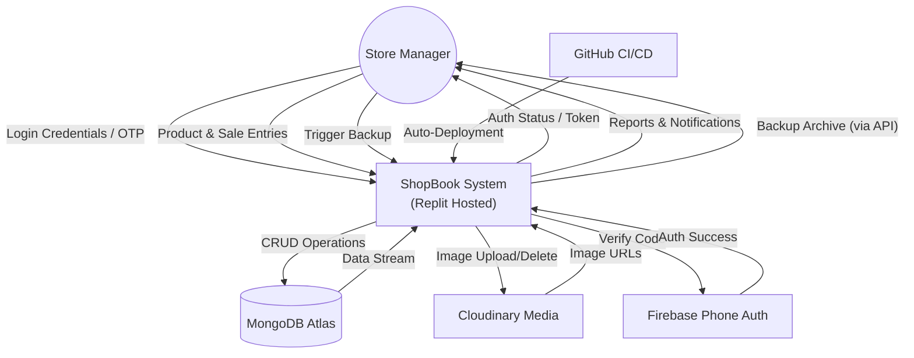
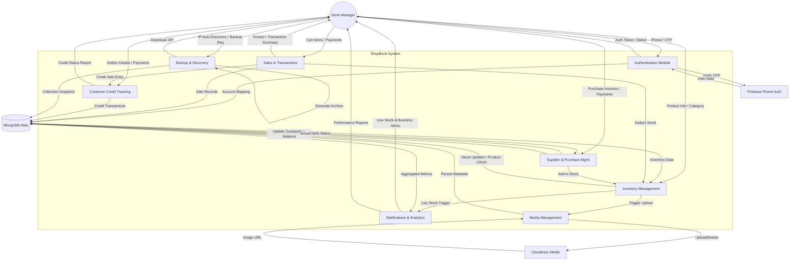

# ShopBook - Data Flow Diagram (DFD) Reference

This document provides a Data Flow Diagram (DFD) for the ShopBook Grocery Shop Manager system, reflecting the final architectural refinements for university submission.

## Level 0: Context Diagram
The Context Diagram shows the system as a single process and its interactions with external entities.

---

## Level 1: Functional Decomposition
The Level 1 DFD breaks down the system into its primary functional modules and shows the data flow between them.

## Key Data Entities
- **Products**: Stores items, barcodes, prices, and stock levels.
- **Sales**: Records of completed transactions and individual invoice items.
- **Customers**: Profiles for credit-eligible customers and their current balance.
- **Credit Transactions**: History of debts and repayments.
- **Suppliers**: Contact info and actual outstanding debt (Total Payable).
- **Purchases**: Historical restock records with payment tracking (Remaining Balance).
- **Notifications**: Log of system-generated alerts.

---
*Technical Specification - ShopBook Group Project.*
