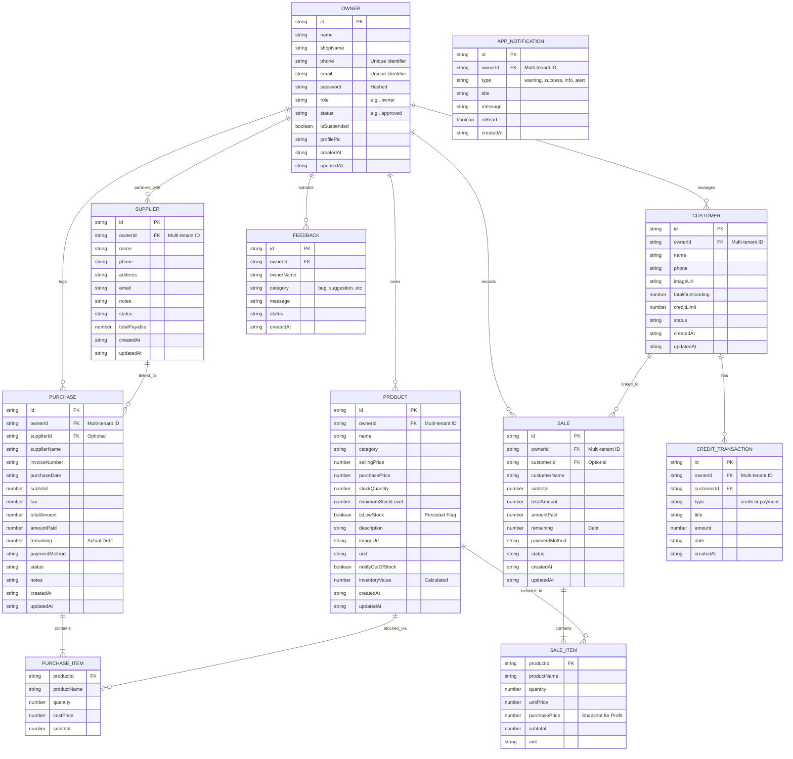

# 🛠️ ShopBook: Entity-Relationship (ER) Diagram

This document contains the core Entity-Relationship (ER) data architecture for **ShopBook**, a modern, full-stack application designed to streamline inventory management, sales tracking, and customer credit.

The diagram is written in Mermaid syntax and reflects the exact domain models used across both the ShopBook backend (MongoDB Atlas) and frontend (Flutter).

## 📋 Architectural Notes

- **Primary Architecture:** ShopBook utilizing a MongoDB Atlas document database. Relationships like `SALE <-> SALE_ITEM` and `PURCHASE <-> PURCHASE_ITEM` are implemented using **Embedded Document Arrays** in the NoSQL schema. This ensures high read performance and historical invoice integrity (snapshots).
- **Multi-tenancy:** The lynchpin of the system is the `ownerId` field present in all core entities. This ensures strict data isolation; a merchant only ever interacts with data where `ownerId` matches their unique session ID.
- **Calculated Fields:** Fields such as `inventoryValue` are denoted as "Calculated". These are computed on-the-fly to ensure the most up-to-date business metrics. In contrast, `isLowStock` is a **Persisted Flag** updated during inventory operations for rapid filtering and dashboard alerts.
- **Data Types:** All timestamp fields (`createdAt`, `updatedAt`, `date`) are stored as **ISO Strings**. This provides maximum cross-platform compatibility between the Node.js backend and the Flutter mobile client.
- **Security:** The `OWNER` password is never stored in plain text (Hashed) and is excluded from standard API responses to the mobile client.

---
*Technical Specification - ShopBook Group Project.*
