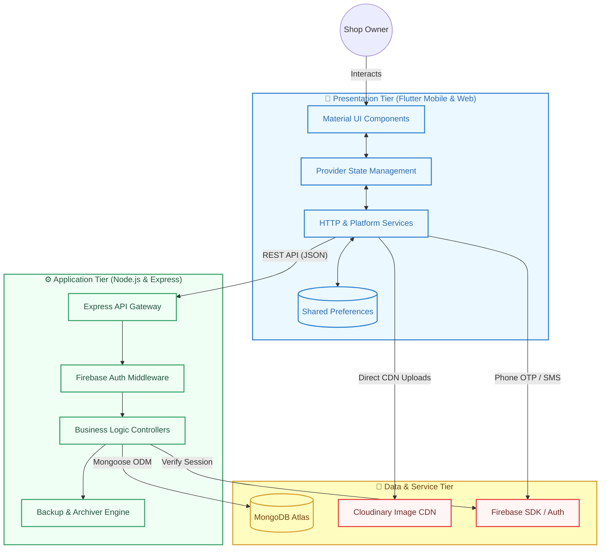

# 🏗️ ShopBook: System Architecture

This document outlines the high-level technical architecture of **ShopBook**, a distributed grocery shop management system. It details the interaction between the mobile client, the cloud-hosted backend, and various third-party integration services.

---

## 🏛️ Architectural Overview

ShopBook follows a **Multi-Tier Client-Server Architecture**, optimized for real-time inventory tracking and cross-platform reliability.

---

## 🔧 Component Stack

### 1. Frontend (Mobile Client)
*   **Framework:** Flutter SDK (Dart)
*   **State Management:** Provider
*   **Networking:** HTTP Package with Interceptors
*   **Offline Support:** Shared Preferences & Path Provider
*   **Reporting:** PDF & Printing Package

### 2. Backend (Cloud API)
*   **Runtime:** Node.js (Long-Term Support version)
*   **Framework:** Express.js
*   **Environment:** Hosted on **Replit Production** (Cloud)
*   **Authentication:** Firebase Admin SDK (Token Verification)
*   **Security:** CORS, Bcryptjs, and Middleware-level validation

### 3. Storage & External Services
*   **Primary Database:** MongoDB Atlas (NoSQL Document Store)
*   **Image Management:** Cloudinary (Automatic resizing & CDN delivery)
*   **User Identity:** Firebase Phone Authentication (SMS Gateway)
*   **CI/CD Pipeline:** GitHub Actions (Automated builds & linting)

---

## 🔄 Core Data Flows

1.  **Authentication Flow:**
    *   Client requests OTP from Firebase.
    *   Firebase sends SMS code to Physical Device.
    *   Client provides code back; Firebase issues UID.
    *   Backend verifies the UID via Firebase Admin SDK.

2.  **Inventory & Media Flow:**
    *   Owner captures product image.
    *   Client uploads directly to **Cloudinary** for efficiency.
    *   Client sends Image URL + Product metadata to **Express API**.
    *   Express persists the reference into **MongoDB**.

3.  **Backup & Recovery:**
    *   Client triggers a backup request.
    *   Express uses `archiver` to snapshot current MongoDB collections.
    *   API generates a secure ZIP stream for the client to download locally.

---
*Technical Specification - ShopBook Group Project.*
