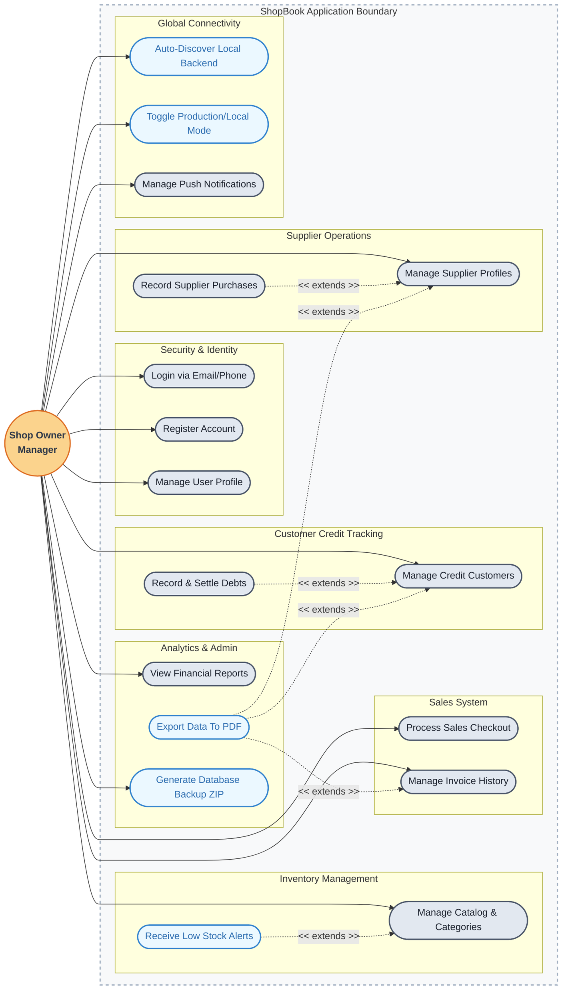

# 🛠️ ShopBook: System Use Case Architecture

**ShopBook** is a modern, full-stack application designed to streamline inventory management, sales tracking, and customer credit for small to medium-sized grocery stores. The following Unified Modeling Language (UML) Use Case Diagram outlines the core functional requirements and the primary interactions between the end-user (Shop Owner) and the system.

---

## 📊 High-Level Use Case Diagram

### 📋 Feature-Level Breakdown

The diagram above translates into the following key actionable use cases designed specifically for the **ShopBook** ecosystem:

1. **Security & Identity (Auth)**
   - **Login / Register**: Owners can authenticate uniquely using dual login capabilities (Email or Phone).
   - **Manage Profile**: Adjust basic credentials and store configurations.

2. **Inventory Management**
   - **Manage Catalog**: Full CRUD controls for store products and visual categories.
   - **Low Stock Alerts**: Automated contextual notifications prompting owners to restock inventory before running out.

3. **Sales System (Point of Sale)**
   - **Process Sales**: Dedicated cart management and checkout UI optimized for speed.
   - **Manage Invoices**: An organized ledger to view or securely delete historical purchase invoices.

4. **Customer Credit Tracking (Debtors)**
   - **Manage Credit Customers**: Build a comprehensive directory for regular shoppers.
   - **Record & Settle Debts**: Add credit records or mark pending balances as paid off.

5. **Supplier Operations**
   - **Manage Profiles**: Track supplier contact information and total payable balances (Actual Debt).
   - **Record Purchases**: Log deliveries dynamically, automatically syncing with product stock levels.

6. **Analytics & Administration**
   - **Financial Reports**: Get overhead insights and accurate profit calculations in real-time.
   - **Universal PDF Export**: One-tap professional PDF generation for Credit Customers, Suppliers, and Receipts. 
   - **Database Backup**: Trigger a server-side routine to archive all MongoDB collections into a portable ZIP format.

7. **Global Connectivity & Utilities**
   - **Auto-Discovery**: Dynamically identify the backend server IP on the local network (UDP Protocol) for development.
   - **Switch Environments**: Seamlessly toggle between Localhost (for rapid iteration) and the Replit Cloud production environment (for live distribution).
   - **Push Notifications**: Unified status updates across the merchant dashboard.

---
*Technical Specification - ShopBook Group Project.*
